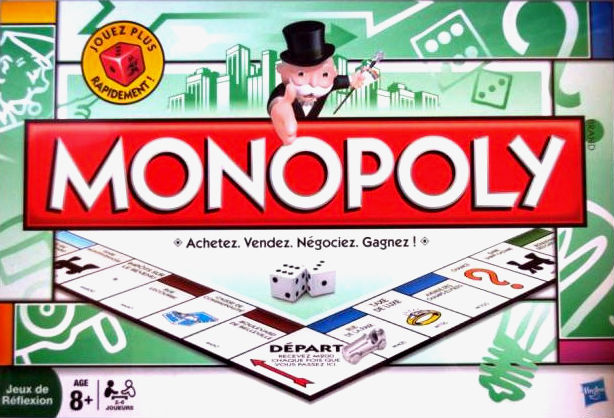
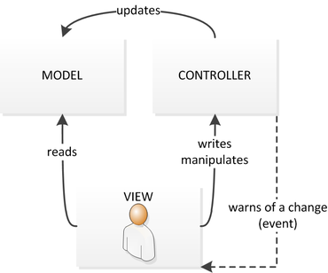

# Monopoly final Project
**Author:** 
- Victor Mouradian
- Virgile Procureur

ESILV S7, Design Pattern, IBO5, 2021

The project
---
>Objective of the project is to simulate a simplified version of the Monopoly™ game



The rules our game has to follow is that the player can go to jail if he lands on the jail case (case 30) or does three double in a row. A game is won when a player reaches 3 fullturn of the board. 

To create the game we will be following the MVC ( Model View Controller ) design pattern.



The model corresponds to the *user* class , the view to the *Viewer* class and the controller to the *game* class.

*User class properties*
```csharp
string Playername;        
bool jailed;
int turn_jailed;
int position;
int fullturn;
int t1, t2;
```
Our model is straightforward, we handle the jail and the dice throws in this class.

The game class handles how the game is run, the most important function is the turn().

*Game.turn()*
```csharp
public void Turn()
        {
            foreach(Player player in Players)
            {
                if(player.Fullturn ==ending)
                {
                    Winner = player;
                    State = 2;
                    Notify();
                }
                if(player.Turn_jailed == 2)
                {
                    player.Player_unjailed();
                }
                if(player.Jailed)
                {
                    Jailed(player);
                }
                else
                {

                    int[] throws = player.Throw_dice();
                    player.Move(throws[0] + throws[1]);
                    int doublecount = 0;
                    if(throws[0] == throws[1])
                    {
                        while (throws[0] == throws[1] )
                        {
                            doublecount += 1;
                            throws = player.Throw_dice();
                            player.Move(throws[0] + throws[1]);
                            if (doublecount == 3) break;
                            if (player.Position == 30) break;
                        }
                        if (doublecount == 3)
                        {
                            player.Player_jailed();
                        }
                    }
                    
                    if(player.Position == 30)
                    {
                        player.Player_jailed();
                    }
                }
                
            }
        }

```

The viewer class handles the turn of the game, it does not print anything to the console directly, unless insctruction to the user and when the game is over.

*Viewer.start()*
```csharp
public void Start()
        {
            game = new Game();
            var PlayerAdditionObserver = new PlayerAdditionObserver();
            var gameoverobserver = new GameOverObserver();
            Player p1 = new Player("victor");
            Player p2 = new Player("Lucas");
            game.AddPlayers(p1);
            game.AddPlayers(p2);
            Player winner = null;
            bool end = false;
            while(end == false)
            {
                game.Turn();
                Console.WriteLine("Press enter to continue...");
                Console.ReadKey();
                if(game.Winner != null)
                {
                    end = true;
                    winner = game.Winner;
                }
            }
            Console.WriteLine(winner.Playername1 + " has won");
            Console.ReadKey();
        }

```

The game logs are written by observers, attach to the user and the game class.

*Example of observers, here for the user class*

```csharp
public class MoveObserver : IPlayerObserver
    {

        public void Update(Player player)
        {
            if(player.State == 1)
            {
                Console.WriteLine(player.Playername1 + " has moved to " + player.Position);
            }
        }
        
    }
```
And here is the IplayerObserver class

*IplayerObserver class*
```csharp
public interface IPlayerObserver
    {
        void Update(Player player);
    }
```
When an action is done ingame, the observers will log the actions and print them into the console.

Here is an example of the output of the console during a game.
```
victor got a 2 and a 5
victor has moved to 7
Lucas got a 2 and a 3
Lucas has moved to 5
Press enter to continue...
victor got a 4 and a 2
victor has moved to 13
Lucas got a 6 and a 3
Lucas has moved to 14
Press enter to continue...
```
Each player throws two dice then moves to a new position.

The program class only starts the Viewer.

Possible Addition
---
- Money Management
- Property Management
    - We could add a property class to grasp the real concept of monopoly wich is owning real estate


